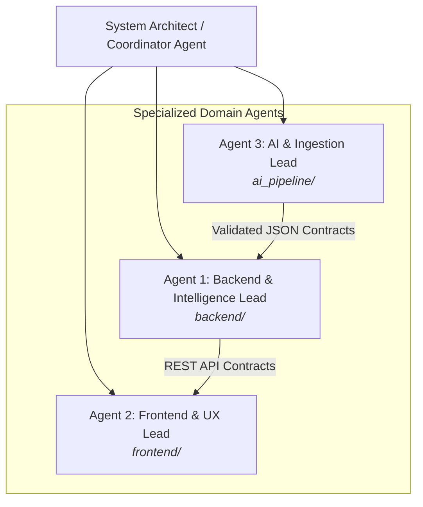

# CampusLink — Multi-Agent Collaboration Protocol & System Roles (`agents.md`)

This document defines the roles, operational boundaries, communication protocols, and execution standards for autonomous and human-assisted AI agents collaborating on the **CampusLink** codebase.

---

## 1. Multi-Agent Team Structure

---

## 2. Agent Roles and Boundaries

### 2.1. Agent 1: Backend & Intelligence Engine Lead (Dev 1)
- **Primary Ownership:** `backend/`, `backend/app/`, `backend/tests/`
- **Core Mission:** Deliver the intelligence pipeline and robust REST API endpoints.
- **Key Responsibilities:**
  1. Build FastAPI application structure, database models (SQLAlchemy), and Pydantic schemas.
  2. Implement **Hard Eligibility Engine**: Deterministic rules (CGPA, branch, backlogs) with explicit pass/fail reasons.
  3. Implement **Semantic Matching & Scoring Engine**: Vector similarity (embeddings) combined with weighted scoring (Skills 40%, Projects 20%, Academics 15%, Assessment 10%, Certifications 10%, Communication 5%).
  4. Expose `GET /jobs/{job_id}/matches`, `POST /jobs/parse`, `GET /students/{id}/readiness`, `GET /students/{id}/skill-gaps/{job_id}`.
  5. Provide seed database loader and fallback mock responses.
- **Strict Boundary:**
  - Do NOT modify `frontend/` or `ai_pipeline/` files directly.
  - Do NOT delegate arithmetic, CGPA filtering, or score sorting to an LLM.

---

### 2.2. Agent 2: Frontend & UX Lead (Dev 2)
- **Primary Ownership:** `frontend/`
- **Core Mission:** Deliver a high-clarity placement officer & recruiter web interface.
- **Key Responsibilities:**
  1. Scaffold modern React + Vite + Tailwind CSS interface.
  2. Build **Recruiter Job View**: Job specification display, candidate ranking table, and filter controls.
  3. Build **Candidate Card & Details Modal**: Display match score (0–100), categorization badge (*Highly Suitable*, *Suitable*, *Potential Fit*), factor breakdown bars, and explanation summary.
  4. Build **Skill Gap & Readiness Dashboard**: Visual breakdown of missing required vs preferred skills, and student readiness tiers.
  5. Consume backend strictly via `docs/contracts/` schemas; use local JSON mocks when backend is offline.
- **Strict Boundary:**
  - Do NOT create direct dependencies on backend Python code or AI pipeline scripts.
  - Rely exclusively on HTTP REST API contracts.

---

### 2.3. Agent 3: AI Pipeline & Ingestion Lead (Dev 3)
- **Primary Ownership:** `ai_pipeline/`, `data/sample_jds/`, `data/sample_resumes/`
- **Core Mission:** Extract unstructured resumes and JDs into structured, validated JSON.
- **Key Responsibilities:**
  1. PDF text extraction via PyMuPDF (`fitz`).
  2. LLM prompts (Google Gemini) for extracting structured student profiles and recruiter JDs.
  3. **Skill Normalization & Taxonomy**: Standardize variants (`ReactJS` $\to$ `React`, `Postgres` $\to$ `PostgreSQL`, `FastAPI` $\to$ `FastAPI`).
  4. Validate output payloads against `docs/contracts/student.schema.json` and `docs/contracts/job.schema.json`.
  5. Provide offline fixture fallbacks if LLM APIs encounter rate limits or network downtime.
- **Strict Boundary:**
  - Do NOT handle candidate scoring or DB persistence directly.
  - Produce clean, contract-compliant JSON payloads for Agent 1 to ingest.

---

## 3. Strict Operational Rules & Principles

### Rule 1: The Deterministic vs. AI Separation Boundary
| Feature | Implementation Mode | Permitted Tools |
| :--- | :--- | :--- |
| **CGPA Check** | Deterministic | Python relational comparison (`cgpa >= min_cgpa`) |
| **Branch Eligibility** | Deterministic | Set membership (`student.branch in eligible_branches`) |
| **Backlog Check** | Deterministic | Comparison (`backlogs <= max_backlogs`) |
| **Weighted Score** | Deterministic | Float arithmetic dot-product |
| **Rank Sorting** | Deterministic | `sorted(candidates, key=lambda c: c.score, reverse=True)` |
| **JD / Resume Extraction** | AI / Semantic | PyMuPDF + LLM (Gemini) JSON schema extraction |
| **Skill Synonyms** | Hybrid | Taxonomy dictionary lookup + embedding similarity |
| **Project Relevance** | AI / Semantic | SentenceTransformer / Gemini embedding cosine similarity |
| **Natural Language Explanations** | AI / Semantic | LLM summary prompt with strict ground truth injection |

### Rule 2: Contract-First Development
- Every agent must adhere to schemas in [`docs/contracts/`](file:///Users/suvasanketrout/developer/CampusLink/docs/contracts).
- Any contract change requires explicit synchronization across all agents before code changes are made.

### Rule 3: Zero-Blocker Local Execution
- **Docker is optional**: The entire prototype must boot and run natively on macOS/Linux using Python 3.12 (`venv`) and Node.js (`npm`).
- SQLite is supported out-of-the-box for local testing, with simple configuration toggle to PostgreSQL.
- Local embeddings (e.g. `all-MiniLM-L6-v2` or sklearn cosine similarity) must provide offline search without mandatory cloud API tokens.

### Rule 4: Mandatory Fixture Fallback
- If an LLM call fails, the pipeline must seamlessly fall back to static fixtures in [`data/`](file:///Users/suvasanketrout/developer/CampusLink/data) so that the live demo is never interrupted.

---

## 4. Day-by-Day Integration Gates

- **Day 1 (Independent Foundations):**
  - All agents code against contract schemas.
  - Agent 1 boots backend with mock responses.
  - Agent 2 builds UI layout with fixture data.
  - Agent 3 tests parser with static test files.
- **Day 2 (Ingestion Gate):**
  - Agent 3 outputs validated JSON. Agent 1 ingests into DB.
- **Day 3 (Core End-to-End Gate - CRITICAL):**
  - Full flow: Recruiter selects JD $\to$ Backend filters & scores candidates $\to$ Frontend renders ranked candidate list.
- **Day 4 (Diagnostics Gate):**
  - Explanations, skill gaps, and readiness metrics connected to UI.
- **Day 5 (Freeze & Polish):**
  - Code freeze on architecture; polish loading states, badges, demo scripts, and tests.

---

## 5. Agent Instructions for Context Retrieval

When any agent starts a task or needs specific information about the codebase:
1. **Always consult [`codebase_idx/README.md`](file:///Users/suvasanketrout/developer/CampusLink/codebase_idx/README.md)** first to locate the authoritative reference.
2. Read [`codebase_idx/contracts.md`](file:///Users/suvasanketrout/developer/CampusLink/codebase_idx/contracts.md) before writing API models or endpoints.
3. Read [`codebase_idx/intelligence_engine.md`](file:///Users/suvasanketrout/developer/CampusLink/codebase_idx/intelligence_engine.md) before altering scoring weights or eligibility filters.
4. Check [`codebase_idx/directory_map.md`](file:///Users/suvasanketrout/developer/CampusLink/codebase_idx/directory_map.md) to preserve module boundaries.
