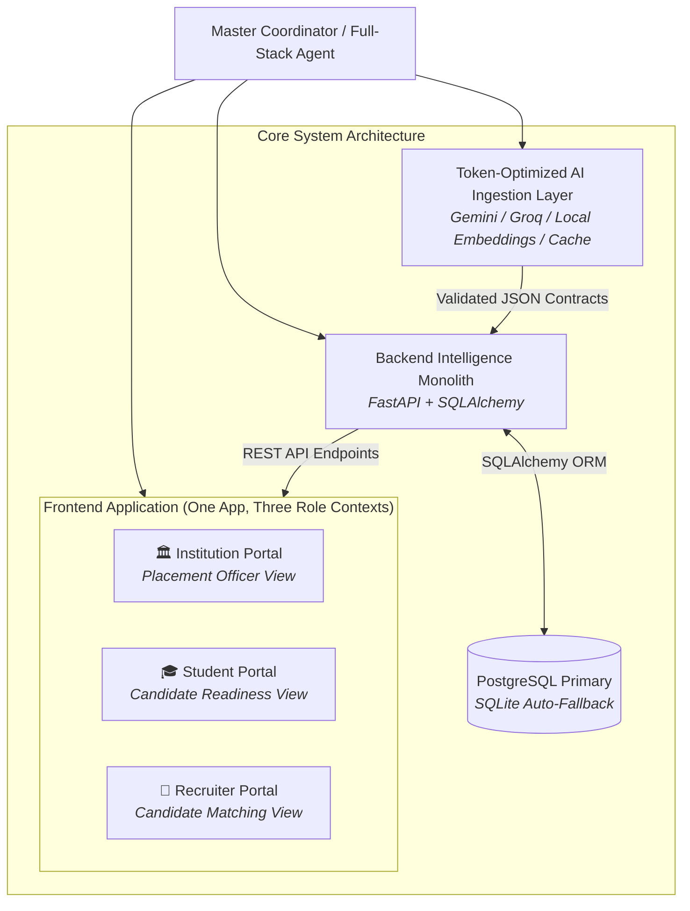

# CampusLink — Multi-Agent Collaboration Protocol & System Roles (`agents.md`)

This document defines the roles, operational boundaries, execution standards, and progression logging protocol for autonomous and human-assisted AI agents collaborating on the **CampusLink** codebase.

**Authoritative Master Specification:** [`new_plan.md`](file:///Users/suvasanketrout/Developer/CampusLink/new_plan.md)
**Task Progression File:** [`TASK_PROGRESSION.md`](file:///Users/suvasanketrout/Developer/CampusLink/TASK_PROGRESSION.md)
*(Note: `init.md` is deprecated and superseded by `new_plan.md`)*

---

## 1. System Architecture & Component Roles



---

## 2. Core Execution Principles & System Rules

### Rule 1: One Unified System, Three Portal Views (Do NOT Split Portals)
Per Section 39.5 of `new_plan.md`:
- The three portals (**Institution**, **Student**, **Company/Recruiter**) are a **product presentation decision**, NOT a reason to create three separate repositories, three backends, or three databases.
- Maintain:
  - **One repository**
  - **One backend**
  - **One database**
  - **One shared intelligence layer**
  - **Three route/role contexts** in the single React + Vite + TypeScript frontend.
- When implementing a feature:
  - If it is domain logic (eligibility, scoring, matching, readiness, skill gaps), implement it once in `backend/app/services/`.
  - If it is presentation, adapt it in the corresponding portal component.

---

### Rule 2: The Deterministic vs. AI Separation Boundary
Never delegate objective rules or mathematical scoring to an LLM.

| Feature | Implementation Mode | Permitted Tools |
| :--- | :--- | :--- |
| **CGPA Check** | Deterministic | Python relational comparison (`cgpa >= min_cgpa`) |
| **Branch Eligibility** | Deterministic | Set membership (`student.branch in eligible_branches`) |
| **Backlog Check** | Deterministic | Comparison (`backlogs <= max_backlogs`) |
| **Weighted Score** | Deterministic | 6-factor float arithmetic dot-product |
| **Rank Sorting** | Deterministic | `sorted(candidates, key=lambda c: c.score, reverse=True)` |
| **Candidate Embeddings** | Local Vector Model | SentenceTransformers (`all-MiniLM-L6-v2`) / scikit-learn cosine similarity (**0 API tokens**) |
| **Grounded Explanations** | Deterministic / Grounded | Fact-based summary template from score breakdown |
| **JD / Resume Extraction** | AI / Semantic | PyMuPDF + Gemini / Groq with SHA-256 caching |
| **Skill Synonyms** | Hybrid | Taxonomy normalization dictionary + embedding similarity |

---

### Rule 3: Execution Staging — UI & Core Architecture First
To maximize platform stability and user experience:
1. **Stage 1 (Data & Persistence):** PostgreSQL primary + SQLite auto-fallback, SQLAlchemy models, Pydantic schemas, and expanded seed data (30+ students, 6 jobs).
2. **Stage 2 (Backend Intelligence):** Hard eligibility, 6-factor scoring, vector matching, skill gaps, readiness engine, and REST APIs.
3. **Stage 3 (Frontend Three-Portal Web App):** React + Vite + TypeScript + Tailwind CSS with top-level portal switcher (Institution, Student, Recruiter).
4. **Stage 4 (AI Ingestion & Parsing):** Pluggable multi-provider adapter (Gemini / Groq / local fixtures) with SHA-256 caching and minimal token consumption.

---

### Rule 4: Database Policy — PostgreSQL Primary with SQLite Fallback
- The system must configure and attempt connection to **PostgreSQL** (`postgresql://localhost:5432/campuslink`) as its primary database.
- If PostgreSQL is not running or connection fails, the session manager must **automatically and seamlessly fall back to SQLite** (`sqlite:///./campuslink.db`) with clear logging.
- The platform must never fail to boot due to database connectivity issues.

---

### Rule 5: Token Conservation & Free-Tier AI Abstraction
- The AI layer must be provider-agnostic and suitable for any free-tier provider (**Google Gemini**, **Groq Cloud**, or **OpenAI-compatible** APIs).
- **Matching is 100% token-free**: Candidate-to-job semantic similarity must run on local embeddings (`all-MiniLM-L6-v2`) or scikit-learn.
- **SHA-256 Caching**: Resume and JD extractions must be cached by content hash to disk/memory so duplicate documents consume 0 tokens.
- **Fixture Fallback**: If external LLM APIs fail or encounter rate limits (HTTP 429), the parser must immediately return pre-parsed fixture data from `data/`.

---

### Rule 6: Mandatory Task Progression Logging
- Any agent or developer working on the codebase **must log every significant step, completed task, and environment event** into [`TASK_PROGRESSION.md`](file:///Users/suvasanketrout/Developer/CampusLink/TASK_PROGRESSION.md).
- Keep the milestone table and task checklist in [`TASK_PROGRESSION.md`](file:///Users/suvasanketrout/Developer/CampusLink/TASK_PROGRESSION.md) updated continuously.

---

## 3. Directory Map & Ownership Responsibilities

```text
campuslink/
├── new_plan.md               # Master root specification (supersedes init.md)
├── agents.md                 # System collaboration rules & protocols (this file)
├── TASK_PROGRESSION.md       # Live execution & task progression tracker
├── docs/contracts/           # Formal JSON schema contracts
│   ├── student.schema.json
│   ├── job.schema.json
│   └── match.schema.json
├── data/                     # Seed datasets & sample fixtures
│   ├── students.json         # 30+ diverse student profiles
│   ├── jobs.json             # 6 diverse job postings
│   ├── sample_jds/           # Raw JD texts/PDFs
│   └── sample_resumes/       # Raw resume PDFs
├── backend/                  # Intelligence engine & FastAPI monolith
│   ├── app/
│   │   ├── api/              # REST route controllers
│   │   ├── core/             # Configuration & environment settings
│   │   ├── db/               # PostgreSQL / SQLite resilient session manager
│   │   ├── models/           # SQLAlchemy database entities
│   │   ├── schemas/          # Pydantic v2 validation contracts
│   │   └── services/         # Intelligence business logic
│   │       ├── eligibility.py
│   │       ├── embeddings.py
│   │       ├── scoring.py
│   │       ├── explanations.py
│   │       ├── recommendations.py
│   │       └── matching.py
│   ├── tests/                # Automated pytest suite
│   ├── requirements.txt      # Python dependencies
│   └── seed_db.py            # Database loader script
├── frontend/                 # Recruiter & Student web interface
│   ├── src/
│   │   ├── components/       # Shared UI widgets (CandidateCard, Modal, Navbar)
│   │   ├── pages/            # InstitutionPortal, StudentPortal, RecruiterPortal
│   │   ├── services/         # API client adapters with fallback mocks
│   │   ├── App.tsx           # App entrypoint & Portal routing
│   │   └── main.tsx          # DOM root
│   ├── package.json          # Vite + React + TS dependencies
│   └── vite.config.ts        # Bundler configuration
└── ai_pipeline/              # Multi-provider AI ingestion & parsing
    ├── parsers/              # PyMuPDF + LLM extractors
    ├── normalizers/          # Skill taxonomy normalizer
    ├── cache/                # SHA-256 disk extraction cache
    └── providers/            # Gemini, Groq, and Fallback adapters
```

---

## 4. Context Retrieval Hierarchy

Before modifying code or adding features:
1. Check [`TASK_PROGRESSION.md`](file:///Users/suvasanketrout/Developer/CampusLink/TASK_PROGRESSION.md) for current phase and open tasks.
2. Consult [`new_plan.md`](file:///Users/suvasanketrout/Developer/CampusLink/new_plan.md) for architectural and business intent.
3. Consult [`codebase_idx/contracts.md`](file:///Users/suvasanketrout/Developer/CampusLink/codebase_idx/contracts.md) before altering schemas.
4. Consult [`codebase_idx/intelligence_engine.md`](file:///Users/suvasanketrout/Developer/CampusLink/codebase_idx/intelligence_engine.md) for exact 6-factor mathematical formulas.
