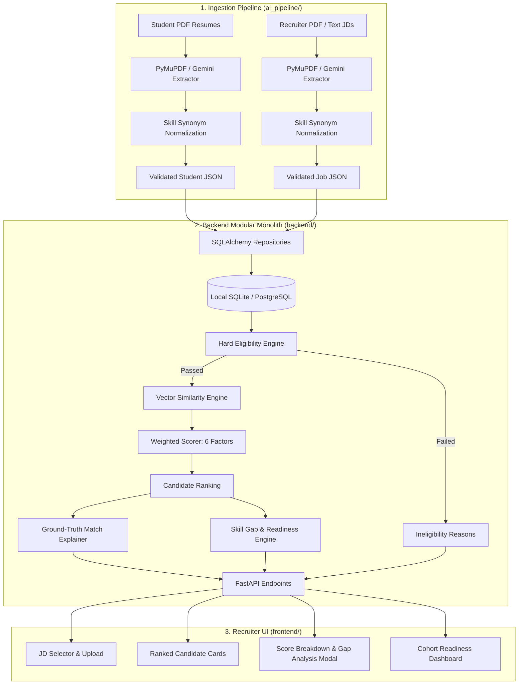

# CampusLink — Architecture & System Design (`codebase_idx/architecture.md`)

## 1. Architectural Philosophy

CampusLink is designed as an **Explainable Intelligence Platform** for university placements. It avoids black-box decision making by strictly dividing responsibilities:

1. **Deterministic Layer (Code):** Evaluates objective criteria (CGPA, active backlogs, degree discipline, weighted dot-product scoring).
2. **Semantic / Embedding Layer (Vectors):** Assesses conceptual alignment between project descriptions, skill taxonomies, and job duties.
3. **Generative Layer (LLM):** Parses unstructured PDF text into structured schemas and generates human-readable diagnostic summaries.

---

## 2. Component Architecture

---

## 3. Layer Separation & Boundaries

### 3.1. Ingestion Layer (`ai_pipeline/`)
- **Technology:** Python 3.12, PyMuPDF (`fitz`), Google Gemini API (`google-genai`).
- **Input:** Unstructured PDFs or plain text strings.
- **Output:** Validated JSON matching [`docs/contracts/student.schema.json`](file:///Users/suvasanketrout/developer/CampusLink/docs/contracts/student.schema.json) and [`docs/contracts/job.schema.json`](file:///Users/suvasanketrout/developer/CampusLink/docs/contracts/job.schema.json).
- **Rule:** Never access database connections or perform matching logic directly.

### 3.2. Core Backend Layer (`backend/`)
- **Technology:** FastAPI, SQLAlchemy 2.0, Pydantic v2, scikit-learn, SentenceTransformers.
- **Data Persistence:** Relational storage for students, jobs, and evaluations. SQLite is zero-dependency default for local development.
- **Rule:** Never delegate sorting, filtering, or arithmetic to an LLM.

### 3.3. Presentation Layer (`frontend/`)
- **Technology:** React, Vite, Tailwind CSS, Lucide icons.
- **State Management:** React hooks / React Query fetching REST endpoints.
- **Rule:** Exclusively consumes backend HTTP REST contracts. Contains internal JSON fixture fallbacks if the backend server is stopped.

---

## 4. Scalability & Deployment Pathways

- **Local Native (Default):**
  - Backend: `uvicorn app.main:app --reload --port 8000` inside Python `venv`.
  - Frontend: `npm run dev` running on `http://localhost:5173`.
  - Storage: `campuslink.db` SQLite file.
- **Containerized / Cloud Ready (Optional):**
  - Backend Dockerfile + Frontend Dockerfile + PostgreSQL 16 with pgvector extension managed via Docker Compose.
