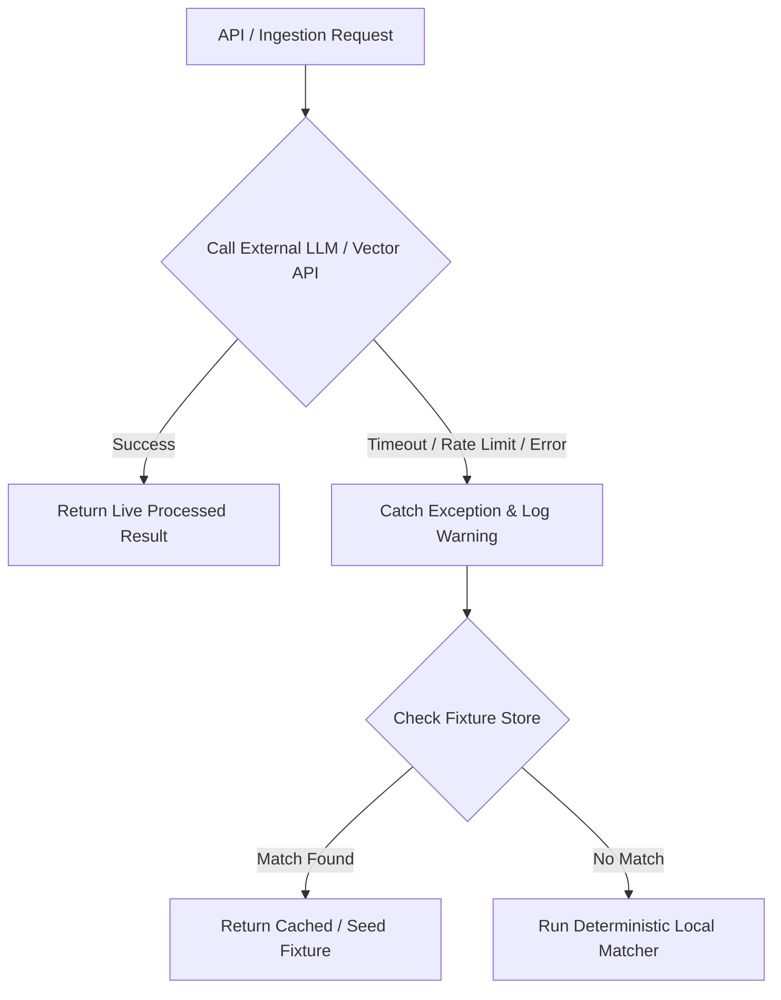

# CampusLink — Data Fixtures & Fallback Strategy (`codebase_idx/data_fixtures.md`)

This document catalogs the seed fixtures in [`data/`](file:///Users/suvasanketrout/developer/CampusLink/data) and explains the fallback mechanism to ensure live demos never fail.

---

## 1. Seed Datasets

### 1.1. Student Profiles (`data/students.json`)
The seed file contains a diverse set of student profiles designed to test distinct edge cases:

| Student ID | Name | Branch | CGPA | Backlogs | Primary Skills | Expected Outcome for JOB001 |
| :--- | :--- | :--- | :--- | :--- | :--- | :--- |
| `STU001` | Aarav Sharma | CSE | 8.7 | 0 | Python, SQL, FastAPI, Docker | **Rank #1 / Highly Suitable** (Meets all criteria) |
| `STU002` | Priya Nair | IT | 8.1 | 0 | React, TypeScript, Node.js | **Suitable** for frontend; missing backend skills for JOB001 |
| `STU003` | Rohan Gupta | ECE | 6.8 | 1 | C++, Embedded Systems | **Ineligible** (CGPA 6.8 < 7.5 cutoff, 1 backlog) |
| `STU004` | Ananya Sen | CSE | 9.2 | 0 | Python, ML, PyTorch | **Highly Suitable / Suitable** for ML; high CGPA |
| `STU005` | Karan Patel | MECH | 7.4 | 0 | AutoCAD, SolidWorks | **Ineligible** (MECH branch not eligible, CGPA < 7.5) |

### 1.2. Job Postings (`data/jobs.json`)
Covers three distinct campus hiring roles:
1. `JOB001` (Nexus Innovations): Backend Software Engineer (Python, SQL, REST API, min CGPA 7.5, CSE/IT, 0 backlogs).
2. `JOB002` (Frontier Cloud Systems): Frontend UI Developer (React, TypeScript, REST API, min CGPA 7.0, CSE/IT/ECE, 0 backlogs).
3. `JOB003` (Cognitive AI Labs): Machine Learning Associate (Python, ML, PyTorch, min CGPA 8.0, CSE/IT, 0 backlogs).

---

## 2. Fallback Policy

### Fallback Implementation Rules
1. **Never let an endpoint return a 500 error due to external API unavailability.**
2. If the Gemini API key is missing or encounters a `429 Too Many Requests`, the ingestion service automatically returns pre-parsed JSON matching the requested ID from `data/sample_jds/` or `data/sample_resumes/`.
3. If sentence embedding generation fails, use character n-gram / token Jaccard similarity as local fallback.
